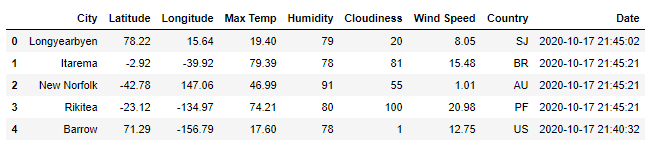
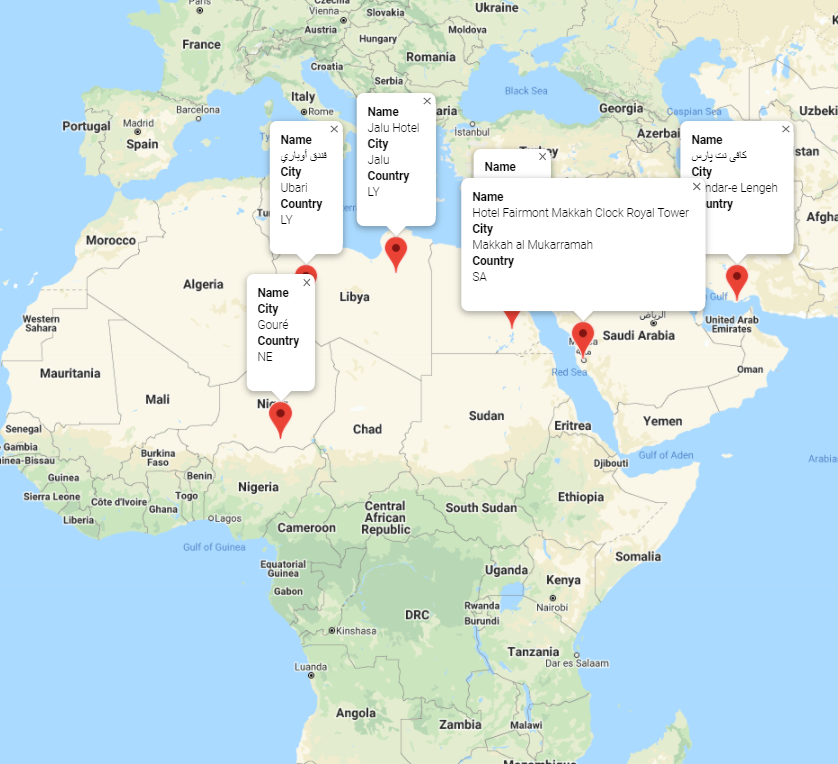

# Weather and Vacation API
What is weather like as you approach the equator? In the below analysis I review weather factors in over 600 cities around the world at varying latitudes and longitudes to see how the temperature, humidity, cloudiness and wind speed are effected as you get closer and farther from the equator.  
  *Below data is a snapshot of data pulled on 10/17/20. Running notebook may result in different results.*

## Table of contents
* [About Weather](#about_weather)
* [Weather by Hemisphere](#weather_by_hemisphere)
* [Ideal Weather](#ideal_weather)
* [Vacation Spots](#vacataion_spots)
* [Conclusion](#conclusion)
* [Jupyter Notebooks](#jupyter_notebooks)
* [Sources](#sources)
* [Contact](#contact)

## About Weather
To gather my random world wide city data, I used a `.random.uniform` function to pull a set of 624 cities from varying latitudes and longitudes. Once I compiled this list, I ran a `for loop` to gather data on each city’s maximum temperature, humidity percent level, cloudiness percent, and wind speed. I added this information to a `DataFrame` to analyze. Due to limitations in pulling the data, I added `time.sleep()` after every 50 cities pulled in my code so that I would not exceed my limit of data pulls from the OpenWeatherMap API. 

## Weather by Hemisphere

## Ideal Weather

## Vacation Spots

## Conclusion

## Jupyter Notebooks

## Sources
 OpenWeatherMap API
 
 Google Places API
 
## Contact
Sara Simoes
