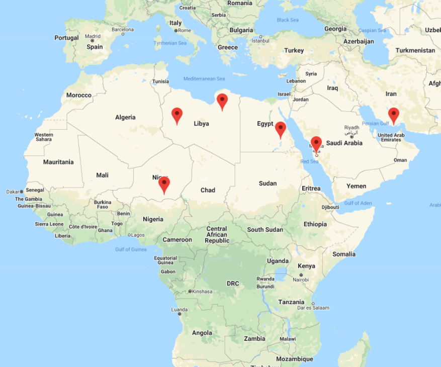

# Weather and Vacation API
What is weather like as you approach the equator? In the below analysis I review weather factors in over 600 cities around the world at varying latitudes and longitudes to see how the temperature, humidity, cloudiness and wind speed are effected as you get closer and farther from the equator.  
  *Below data is a snapshot of data pulled on 10/17/20. Running notebook may result in different results.*

## Table of contents
* [About Weather](#about_weather)
* [Weather by Hemisphere](#weather_by_hemisphere)
* [Ideal Weather](#ideal_weather)
* [Vacation Spots](#vacataion_spots)
* [Conclusion](#conclusion)
* [Jupyter Notebooks](#jupyter_notebooks)
* [Sources](#sources)
* [Contact](#contact)

## About Weather
To gather my random world wide city data, I used a `.random.uniform` function to pull a set of 575 cities from varying latitudes and longitudes. Once I compiled this list, I ran a `for loop` to gather data on each city’s maximum temperature, humidity percent level, cloudiness percent, and wind speed. I added this information to a `DataFrame` to analyze. Due to limitations in pulling the data, I added `time.sleep()` after every 50 cities pulled in my code so that I would not exceed my limit of data pulls from the OpenWeatherMap API. 

I then used the `py.plt` function to show my data in scatter plots below. 

Within my data set of 575 random cities all over the world, there is a correlation between the city’s Latitude with the temperature. As the city becomes closer to the equator (latitude of 0°) the temperature increases. As the city locations move farther away from the equator, the temperature decreases. My data set has more data for the Northern Hemisphere and the coldest max temperatures can be found at a latitude location of 80°. 

Although humidity can be high at all Latitude locations, at the equator it is consistently high and there is no data to suggest low humidity near 0° latitude. 

There appears to be no real correlation to of Cloudiness to latitude accept that at the equator, like humidity, there appears to always be a percent of cloud formation.

There is no correlation between wind speed and latitude. There are some outlying data points in the upper norther hemisphere. 

## Weather by Hemisphere

When reviewing the data by hemisphere, the same correlations can be seen as above. On these plots I have illustrated the results further with line regression as well as the equation of the line. To calculate line regression and line equation, I used the following code: 

`(slope, intercept, rvalue, pvalue, stderr) = linregress(x_values, y_values)`

`regress_values = x_values * slope + intercept`

`line_eq = "y = " + str(round(slope,2)) + "x + " + str(round(intercept,2))`

In the Northern Hemisphere and Southern Hemisphere, there is a direct correlation of temperature increase as you get closer to the equator, latitude 0°. These scatter plots show a negative line regression in the Northern Hemisphere and a positive line regression in the Southern Hemisphere. 

Humidity percentage has a positive line regression in both the Northern and Southern Hemisphere. These plots also illustrate that there is only High Humidity percentage at 0° latitude.

Although the line regression value is greater in the Northern Hemisphere, there is no visible correlation between latitude and cloudiness in the Northern Hemisphere and the southern Hemisphere. 

There is no correlation between wind speed and latitude location. There is a positive line regression in the Northern Hemisphere and a negative line regression in the Southern Hemisphere. 

## Ideal Weather

What is your ideal weather for a vacation spot? Is it warm temperature? Or low humidity? I used the `.loc` function to run through my data set based on 4 criteria I set to find locations containing my ‘ideal weather’. The four criteria were:

*Max Temperature below 85 degrees Fahrenheit 
*Max Temperature above 75 degrees Fahrenheit 
*Humidity percentage below 35%
*Wind Speed below 10mph. 

With this criterion, I created a new `DataFrame` with the below cities:

## Vacation Spots

I then used the Google Places API to locate Hotels within a radius of 5000 meters. 

I then added the marker locations to my google map with this code 

` markers = gmaps.marker_layer(marker_locations)`

I also added `name boxes` to the heat map to display the hotel information. 

## Conclusion

In conclusion, there is a correlation of weather trends as you get closer and farther away from the equator.  The weather is warmer and more humid the closer you are to the equator. There is not a noticeable correlation between wind speed and cloudiness as you move closer and farther from the equator. The results from the Northern and Southern Hemisphere illustrate the same conclusions. 

If you are looking for a warm, dry place in the month of October, Northern Africa is the place to be. 

## Jupyter Notebooks

http://localhost:8889/notebooks/WeatherPy/WeatherPyStarter.ipynb

http://localhost:8889/notebooks/VacationPy/VacationPyStarter.ipynb

## Sources
 OpenWeatherMap API
 
 Google Maps API 
 
 Google Places API
 
## Contact
Sara Simoes
