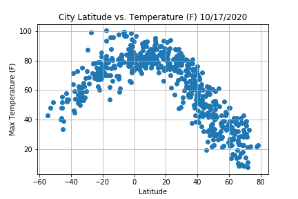
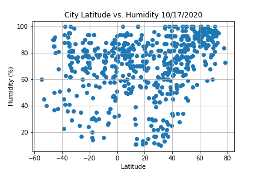
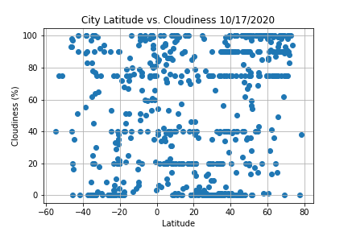
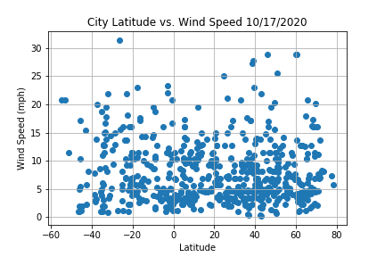
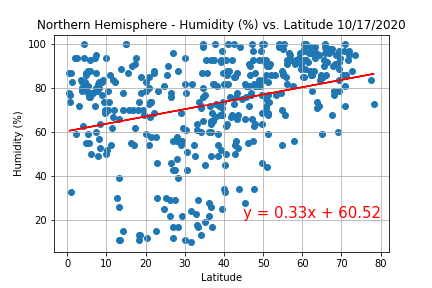
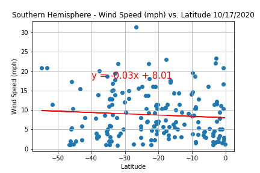

# Weather API
# Weather and Vacation API
> Here goes your awesome project description!

## Table of contents
* [About Weather](#about_weather)
* [Weather by Hemisphere](#weather_by_hemisphere)
* [Ideal Weather](#ideal_weather)
* [Vacation Spots](#vacataion_spots)
* [Conclusion](#conclusion)
* [Jupyter Notebooks](#jupyter_notebooks)
* [Contact](#contact)

## About Weather

## Weather by Hemisphere

## Ideal Weather

## Vacataion Spots

## Conclusion

## Jupyter Notebooks

## Contact
Sara Simoes
